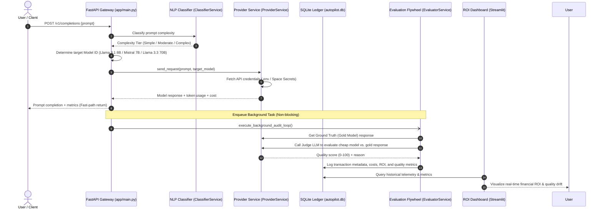

## LLM Cost Autopilot Gateway

An asynchronous, production-grade AI gateway designed to dynamically optimize
enterprise LLM consumption expenditures by **30%+ with zero semantic quality
drop**.

The system intercepts incoming prompts, predicts processing complexity via a
local machine learning engine under 5 milliseconds, routes traffic to the most
economical capable tier, and continuously performs out-of-band quality
verification via an asynchronous evaluation flywheel (LLM-as-a-Judge).

---

## 🏗️ System Architecture & Data Flow

Below is the architectural layout of the gateway showing how inbound traffic is
processed, routed, audited, and visualized:



---

## 🌟 Key Features

- **Dynamic Complexity Classification**: Local NLP classifier
  (`TfidfVectorizer` + `LogisticRegression` via `scikit-learn`) classifying
  prompt difficulty into `simple`, `moderate`, or `complex` in **under 5
  milliseconds**.
- **Decoupled Async Auditing Flywheel**: Uses FastAPI's `BackgroundTasks` to
  perform out-of-band LLM-as-a-Judge quality checks, keeping the API gateway
  response time extremely fast.
- **Drift & Quality Degradation Guardrails**: The evaluation flywheel flags
  responses whose quality score falls below `80.0`, triggering drift alerts for
  model fine-tuning or prompt adjustments.
- **Real-Time ROI Analytics Console**: Streamlit dashboard showing financial
  return on investment (ROI), net capital dollars saved, token metrics, average
  latency, and complete transaction logs.
- **Standardized OpenAI Compatibility**: Outbound payloads are formatted
  according to OpenAI completions standards, supporting unified integration with
  upstream providers like Groq and Mistral AI.

---

## 🛠️ Technology Stack

- **Core Gateway**: FastAPI, Uvicorn, HTTPX (Asynchronous HTTP requests client)
- **Machine Learning**: Scikit-Learn, NumPy, Tiktoken (Token footprint
  estimation)
- **Frontend Dashboard**: Streamlit, Pandas
- **Database**: SQLite3 (Persistent audit logging)
- **Deployment & Infrastructure**: Docker, Docker Compose, Hugging Face Spaces

---

## 📂 Project Directory Structure

```text
LLM-COST-AUTOPILOT/
├── app/
│   ├── core/
│   │   └── config.py          # App configurations & DB paths
│   ├── db/
│   │   ├── database.py        # Database setup and connection engine
│   │   └── models.py          # Data insertion and analytical aggregation
│   ├── schemas/
│   │   └── router_schema.py   # Pydantic data schemas
│   ├── services/
│   │   ├── classifier_service.py # NLP Classifier (Logistic Regression)
│   │   ├── evaluator_service.py  # Asynchronous LLM-as-a-Judge engine
│   │   └── provider_service.py   # Outbound REST API client (httpx)
│   └── main.py                # FastAPI main entrypoint and CLI simulation
├── config/
│   └── routing_config.yaml    # Pricing model mappings and API base URLs
├── dashboard/
│   └── app.py                 # Telemetry & ROI Streamlit Dashboard
├── data/
│   └── seed_prompts.json      # Template payload logs
├── notebooks/
│   └── train_classifier.ipynb # Classifier research and notebook sandbox
├── .env.example               # Environment variables template
├── app_hf.py                  # Streamlit App entrypoint for Hugging Face Spaces
├── Dockerfile                 # Multi-port Docker container configuration
├── docker-compose.yml         # Container services orchestration
├── requirements.txt           # Python dependency manifests
└── README.md                  # This README document
```

---

## 🚀 Setup & Execution

### Option 1: Local Setup

1. **Clone the Repository**:
   ```bash
   git clone https://github.com/yourusername/LLM-COST-AUTOPILOT.git
   cd LLM-COST-AUTOPILOT
   ```
2. **Create a Virtual Environment & Install Dependencies**:
   ```bash
   python -m venv .venv
   source .venv/bin/activate  # On Windows: .venv\Scripts\activate
   pip install -r requirements.txt
   ```
3. **Setup Environment Variables**: Create a `.env` file in the root directory
   using the template:
   ```bash
   cp .env.example .env
   ```
   Populate your `.env` with your API keys:
   ```env
   GROQ_API_KEY=gsk_your_groq_key
   MISTRAL_API_KEY=your_mistral_key
   ```
4. **Run FastAPI Backend Gateway**:
   ```bash
   uvicorn app.main:app --reload --port 8000
   ```
5. **Run Streamlit Dashboard Console**:
   ```bash
   streamlit run dashboard/app.py --server.port 8501
   ```
   Access the dashboard at [http://localhost:8501](http://localhost:8501).

---

### Option 2: Docker Orchestration

1. Create a `.env` file in the root directory with your keys.
2. Start the entire stack (FastAPI on port `8000` + Streamlit on port `8501`):
   ```bash
   docker-compose up --build -d
   ```
3. Stop the containers:
   ```bash
   docker-compose down
   ```

---

### Option 3: Hugging Face Spaces Deployment

When deploying to Hugging Face Spaces:

1. Set the Space SDK to **Streamlit** (configured automatically via the YAML
   header in `README.md`).
2. Add your API credentials as Space Secrets under **Settings > Variables and
   secrets**:
   - `GROQ_API_KEY`
   - `MISTRAL_API_KEY`
3. Push the code to your Hugging Face Space repository. The Space will
   automatically build and run the Streamlit app.

---

## 📈 Cost Saving & ROI Analysis

The gateway evaluates savings using the following heuristics:

1. **Baseline Premium Cost**: The cost of executing the transaction entirely on
   the Premium model (e.g., Llama 3.3 70B costing $0.25/$0.25 per million
   tokens).
2. **Actual Cost**: The cost of executing the transaction on the routed model
   (e.g., Llama 3.1 8B costing $0.05/$0.08 per million tokens for simple tasks).
3. **Net Savings Formula**:
   $$\text{Net Savings} = \text{Baseline Premium Cost} - \text{Actual Cost}$$
4. **Quality Parity**: The Judge LLM rates the semantic alignment between routed
   and gold responses on a scale from 0 to 100. Over time, the dashboard
   aggregates this to show the Average Quality Parity, ensuring cost savings do
   not impact production performance.
