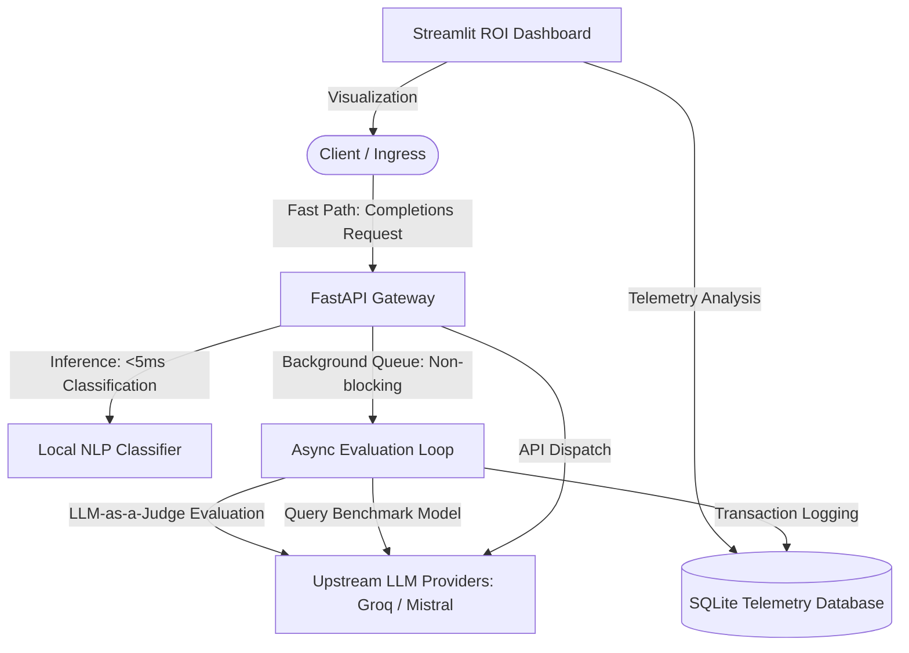
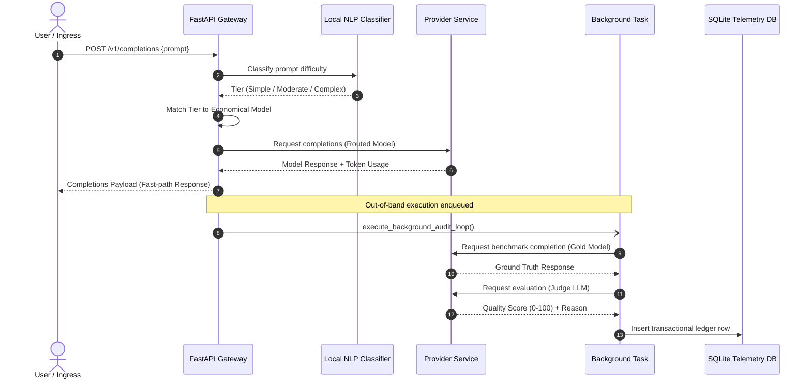
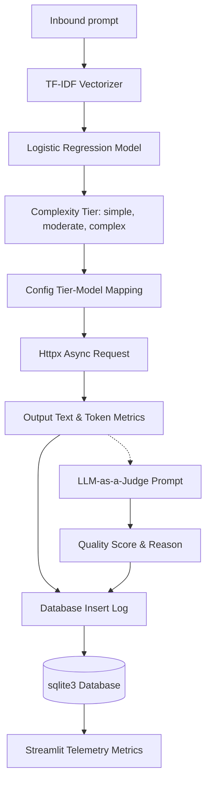

# LLM Cost Autopilot Gateway

An asynchronous, production-grade cost-optimizing AI gateway designed to dynamically route enterprise LLM prompts to the most economical capable model. By predicting prompt complexity locally in under 5 milliseconds, the gateway saves **30%+ on API transaction costs** with zero semantic quality degradation.

[](https://python.org)
[](https://fastapi.tiangolo.com)
[](https://streamlit.io)
[](https://scikit-learn.org)
[](LICENSE)

---

## Technical Presentation

### Core Dashboard Interface


---

## Key Features

- **Local Complexity Classification**: A light NLP classifier (`TfidfVectorizer` + `LogisticRegression` via `scikit-learn`) resolves prompt difficulty into `simple`, `moderate`, or `complex` tiers in **under 5 milliseconds** with zero external network overhead.
- **Decoupled Asynchronous Auditing**: Uses FastAPI's `BackgroundTasks` queue to run out-of-band LLM-as-a-Judge evaluations. This keeps the API response path extremely fast by ensuring that evaluations do not block the client completion loop.
- **Quality Parity Drift Guardrails**: Evaluates cheap model responses against a gold standard response (Mistral 7B) using an automated judge prompt. Scores below `80.0` trigger automatic drift alerts, signaling the need for routing threshold modifications.
- **Real-Time ROI Analytics**: A Streamlit telemetry dashboard visualizing transaction counts, accumulated spend, average latency, Net financial dollars saved, and complete SQLite audit trails.
- **Unified Provider Adapter**: Supports standard OpenAI-compatible API schemas to integrate with high-performance inference providers (like Groq and Mistral AI) with automatic cost calculation.

---

## Architecture Overview

### 1. Overall System Architecture
The gateway splits inbound completion requests into a synchronous fast-path response and a non-blocking background audit loop.



### 2. Request Flow Lifecycle
The sequence below illustrates the lifecycle of a prompt payload execution, highlighting the instant API return and out-of-band database logging.



### 3. Telemetry Data Flow
Shows how text token footprints are calculated, routed, evaluated, and captured in the persistence layer.



---

## Tech Stack

* **Backend Framework**: `FastAPI` (Fully asynchronous ASGI Web API), `Uvicorn`
* **Machine Learning**: `Scikit-learn` (Feature extraction & classification), `NumPy`
* **Client & Telemetry**: `HTTPX` (Asynchronous HTTP requests), `Tiktoken` (Byte-pair encoding tokenizer)
* **Visualization**: `Streamlit` (Interactive data dashboard), `Pandas`
* **Database**: `SQLite3` (Audit log persistence)
* **Infrastructure**: `Docker`, `Docker-compose`

---

## Project Structure

```text
LLM-COST-AUTOPILOT/
├── app/
│   ├── core/
│   │   └── config.py          # App settings, DB paths, logging configurations
│   ├── db/
│   │   ├── database.py        # SQLite connections and table schema setup
│   │   └── models.py          # Database insertion queries and aggregations
│   ├── schemas/
│   │   └── router_schema.py   # Pydantic schemas and serialization contracts
│   ├── services/
│   │   ├── classifier_service.py # TF-IDF + Logistic Regression classification service
│   │   ├── evaluator_service.py  # LLM-as-a-Judge quality verification audit engine
│   │   └── provider_service.py   # Async HTTPX network provider adapter
│   └── main.py                # Main FastAPI entrypoint & CLI simulation
├── config/
│   └── routing_config.yaml    # Provider base URLs, models registry, tier mappings
├── dashboard/
│   └── app.py                 # Streamlit Telemetry Dashboard
├── data/
│   └── seed_prompts.json      # Dataset seed payloads
├── notebooks/
│   └── train_classifier.ipynb # NLP classification research workspace
├── tests/
│   ├── test_api.py            # Integration tests for FastAPI endpoints
│   ├── test_classifier.py     # Unit tests for ClassifierService
│   ├── test_evaluator.py      # Unit tests for EvaluatorService
│   └── test_provider.py       # Unit tests for ProviderService
├── .env.example               # Environment credentials layout
├── app_hf.py                  # Streamlit application for Hugging Face Spaces
├── Dockerfile                 # Unified container definition
├── docker-compose.yml         # Development services deployment
├── LICENSE                    # MIT License file
├── Makefile                   # Developer commands shortcut
├── pyproject.toml             # Development tool configurations (Ruff, Black, Pytest)
└── requirements.txt           # Main production requirements manifests
```

---

## Installation

### Prerequisites
- Python 3.10+
- Pip package manager

### Steps
1. **Clone the repository**:
   ```bash
   git clone https://github.com/divyyadav007/LLM-COST-AUTOPILOT.git
   cd LLM-COST-AUTOPILOT
   ```

2. **Create a virtual environment and install packages**:
   ```bash
   python -m venv .venv
   source .venv/bin/activate  # On Windows use: .venv\Scripts\activate
   pip install -r requirements.txt
   pip install -e .[dev]      # Install development dependencies
   ```

3. **Configure Environment Variables**:
   Create a `.env` file in the root directory:
   ```bash
   cp .env.example .env
   ```
   Add your API credentials:
   ```env
   GROQ_API_KEY=gsk_your_groq_key
   MISTRAL_API_KEY=your_mistral_key
   ```

---

## Running Locally

### 1. Launch FastAPI Backend Gateway
To run the async router API server:
```bash
make run-api
```
Or run directly:
```bash
uvicorn app.main:app --reload --port 8000
```
API Documentation is available at [http://localhost:8000/docs](http://localhost:8000/docs).

### 2. Launch Streamlit Telemetry Dashboard
To view the ROI charts and transaction logs:
```bash
make run-dashboard
```
Or run directly:
```bash
streamlit run dashboard/dashboard.py --server.port 8501
```
Access the dashboard in your browser at [http://localhost:8501](http://localhost:8501).

### 3. Run Development Commands
- **Lint Code**: `make lint`
- **Format Code**: `make format`
- **Run Tests**: `make test`

---

## Running with Docker

1. Ensure your `.env` contains your API credentials.
2. Spin up both the FastAPI backend (`port 8000`) and Streamlit dashboard (`port 8501`):
   ```bash
   docker-compose up --build -d
   ```
3. Shut down the containers:
   ```bash
   docker-compose down
   ```

---

## Environment Variables

The gateway reads the following environment keys:

| Variable | Required | Description |
|---|---|---|
| `GROQ_API_KEY` | Yes (or fallback) | API Key for Groq upstream completions client |
| `MISTRAL_API_KEY` | Yes (or fallback) | API Key for Mistral AI benchmark/judge models |
| `LOG_LEVEL` | No (Default: `INFO`) | Python logger verbose level (`DEBUG`, `INFO`, `WARNING`, `ERROR`) |

---

## How it Works

The routing flow follows a three-step path:

1. **Local Categorization**: 
   When a prompt is sent to `/v1/completions`, `ClassifierService` tokenizes the input text and projects it onto a pre-fit TF-IDF space. A Logistic Regression model predicts one of three difficulty classes. 
2. **Dynamic Routing**:
   The gateway translates the predicted tier to the mapped model ID according to the definitions in `routing_config.yaml`:
   * **Simple**: routes to Llama 3.1 8B (economical/fast path)
   * **Moderate**: routes to Mistral 7B
   * **Complex**: routes to Llama 3.3 70B (powerful/premium path)
3. **Out-of-Band Audit Loop**:
   Immediately after returning the response, a background task sends the prompt to the premium benchmark model and dispatches an evaluation comparison to a judge LLM (using the Mistral 7B). If the comparison score drops below the 80% parity threshold, the `escalate_flag` is logged, pointing out a potential routing drift.

---

## Performance Notes

- **Routing Overhead**: The local ML model routing logic executes in **under 5 milliseconds**, adding negligible latency to LLM client network roundtrips.
- **Decoupled Auditing**: Because the LLM-as-a-judge comparison is executed asynchronously via FastAPI's background tasks, it does not add to the time-to-first-token (TTFT) or total latency experienced by the client.

---

## Future Improvements

- **Reinforcement Learning from Feedback (RLF)**: Continuously adjust complexity classification thresholds based on aggregated judge scores to dynamically balance cost and quality.
- **Redis Cache Integration**: Introduce semantic prompt caching to avoid re-routing and re-evaluating identical semantic prompt structures.
- **Provider Failover**: Implement circuit-breaker logic to failover requests to equivalent backup models in case of primary provider outages.

---

## License

This project is licensed under the MIT License - see the [LICENSE](LICENSE) file for details.

---

## Contact

**Divyanshu Yadav** - [divyyadav007](https://github.com/divyyadav007)
Project Link: [https://github.com/divyyadav007/LLM-COST-AUTOPILOT](https://github.com/divyyadav007/LLM-COST-AUTOPILOT)
